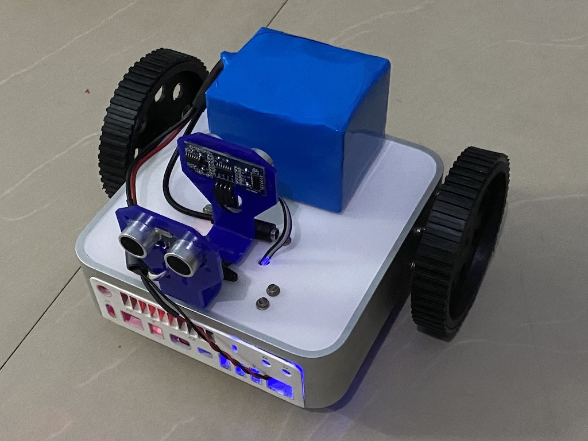

# GustroBot
Autonomous Robot built using cheap sensors and Raspberry Pi

## Execute the code
Run the bash script 

```sh
sh run.sh test.py
```

## Hardware

The entire robot is built from scratch using the below components. 



Note: Links to the site Robu.in are just for a reference and product description. 

* [Raspberry Pi 3 B+](https://robu.in/product/raspberry-pi-3-model-b-bcm2837b0-soc-iot-poe-enabled/)
* [Ultrasonic Sensor HC-SR04](https://robu.in/product/hc-sr04-ultrasonic-range-finder-cartoon-ultrasonic-sensor-mounting-bracket/)
* [Nema 17 - Stepper Motor](https://robu.in/product/nema17-40mm-1-2a-unipolar-stepper-motor-w-1m-cable/)
* [MPU-9265 3-axis 9-DOF](https://robu.in/product/mpu9250-9-axis-attitude-gyro-accelerator-magnetometer-sensor-module/)
* [Robot Wheel 10cm Dia](https://robu.in/product/robot-wheel-3-10cm-x-2cm/)
* [CNC shield V3 - Stepper Motor Controller](https://robu.in/product/cnc-shield-v3-engraving-machine-3d-printer-a4988-drv8825-driver-expansion-board/)
* [DRV8825 Stepper Motor Driver](https://robu.in/product/drv8825-stepper-motor-driver-aluminum-heat-sink-good-quality/)
* [18650 Li-ion 6000mAh 14.8v Protected Battery Pack](https://robu.in/product/18650-li-ion-6000mah-14-8v-4s3p-protected-battery-pack/)
* [DC-DC 4.5-40V To 5V 2A USB Charger Step down Converter - for powering Raspberry Pi](https://robu.in/product/dc-dc-4-5-40v-5v-2a-usb-charger-step-converter-voltmeter-modul/)
* [LM2596S DC-DC Buck Converter - for powering other boards](https://robu.in/product/lm2596s-dc-dc-buck-converter-power-supply/)

